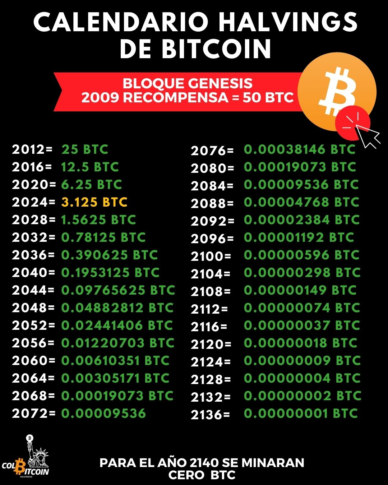

# Solo habrá 21 millones de bitcoins

A diferencia de las monedas fiduciarias, que se pueden imprimir infinitamente, Bitcoin tiene una oferta fija. Nunca habrá más de 21 millones de BTC.

¿Pero por qué? ¿Y cómo aplica Bitcoin este límite?

La escasez de Bitcoin está estrictamente codificada

La oferta de Bitcoin se rige por un código, no por políticos ni bancos centrales. Los nuevos bitcoins entran en circulación mediante la minería, pero siguen estrictas reglas matemáticas:

✔️ Cada 10 minutos, los mineros procesan transacciones y añaden un nuevo bloque a la blockchain.

✔️ Cada vez que lo hacen, reciben una recompensa con bitcoins recién acuñados; esto se denomina subsidio por bloque.
Pero aquí está la trampa: el subsidio por bloque no es constante.

**El ciclo del halving: Calendario de suministro de Bitcoin**

Cada 210.000 bloques (aproximadamente cada 4 años), la recompensa por minar un bloque se reduce a la mitad. Este evento se denomina halving.

🟠 2009: Los mineros ganaron 50 BTC por bloque

🟠 2012: Bajó a 25 BTC

🟠 2016: Bajó a 12,5 BTC

🟠 2020: Bajó a 6,25 BTC

🟠 2024: 3,125 BTC por bloque

Este ciclo continúa hasta el año 2140, cuando se minará la última fracción de un bitcoin.

## ¿Por qué Bitcoin no supera los 21 millones?

La oferta de Bitcoin sigue una curva asintótica, lo que significa que se acerca infinitamente a los 21 millones, pero nunca la supera.

**Piénsalo así:**

Imagina partir una pizza por la mitad. Y luego volver a partirla por la mitad. Y otra vez. No importa cuántas veces la dividas, nunca te quedarás sin porciones; solo obtendrás porciones cada vez más pequeñas.

Así funciona Bitcoin. Cada halving ralentiza la emisión de nuevas unidades, lo que garantiza que Bitcoin siga siendo escaso.

## ¿Qué sucederá después de 2140?

Cuando se mine la última fracción de BTC en 2140, los mineros dejarán de recibir un subsidio por bloque.

Pero seguirán teniendo un incentivo para proteger la red, ya que ganarán comisiones por transacción en lugar de nuevos bitcoins.

El suministro fijo de Bitcoin es una de sus características más poderosas. Sin rescates. Sin inflación. Sin manipulación monetaria. Solo escasez pura, matemáticamente impuesta.

Monedas sólidas. Dinero contundente. El dinero más escaso jamás creado.

Pero esto nos lleva a preguntarnos... Si Bitcoin se lanza según un calendario predecible, ¿qué sucederá si los mineros aceleran? ¿O disminuyen? Lo abordaremos en el proximo articulo.
