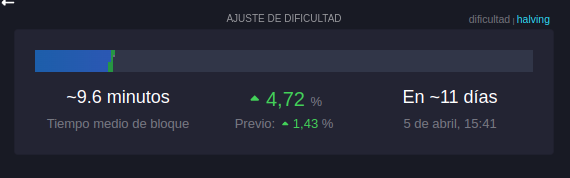

# Ajuste de dificultad

En el articulo anterior se hablo sobre el suministro fijo de Bitcoin y cómo solo existirán 21 millones de BTC. Pero esto plantea una pregunta…

Si los bitcoins se crean mediante la minería, ¿qué sucede si los mineros empiezan a encontrar bloques más rápido de lo esperado?

¿Llegaríamos a los 21 millones de bitcoins antes de 2140?

No, porque Bitcoin tiene un mecanismo de autorregulación integrado: el ajuste de dificultad.

## ¿Por qué es necesario el ajuste de dificultad?

Bitcoin está diseñado para producir un nuevo bloque cada 10 minutos, pero la minería es un proceso competitivo.

✔️ Si se unen más mineros, la potencia de procesamiento total de la red (hashrate) aumenta.

✔️ Más mineros = descubrimiento de bloques más rápido.

✔️ Bloques más rápidos = más bitcoins minados antes de lo previsto.

Para contrarrestar esto, Bitcoin ajusta automáticamente la dificultad de la competencia minera cada **2016 bloques**(aproximadamente cada dos semanas) para garantizar que los bloques se sigan minando a un ritmo constante.

Si se encuentran bloques demasiado rápido, la dificultad aumenta.

Si los mineros abandonan la minería y los bloques tardan demasiado, la dificultad disminuye.

Esto garantiza que, independientemente de cuántos mineros compitan, el calendario de suministro de Bitcoin se mantenga predecible.

## Diferencias entre Bitcoin y el Oro

A medida que el precio del oro sube, la minería de oro se vuelve más rentable. Esto permite a los mineros extraer oro que antes era demasiado caro, aumentando la oferta y frenando las subidas de precio.

**Bitcoin no funciona así.**

✅ No importa cuánto suba el precio de Bitcoin… el calendario de suministro se mantiene igual.

✅ No importa cuántos mineros se unan a la red… el calendario de suministro se mantiene igual.

Esta es una de las propiedades más singulares de Bitcoin: una verdadera constante monetaria en un mundo de incertidumbre.

Un activo escaso que no se puede inflar, manipular ni acelerar.

El ajuste de dificultad es lo que mantiene a Bitcoin en el buen camino, pase lo que pase.
Consulta los comentarios.