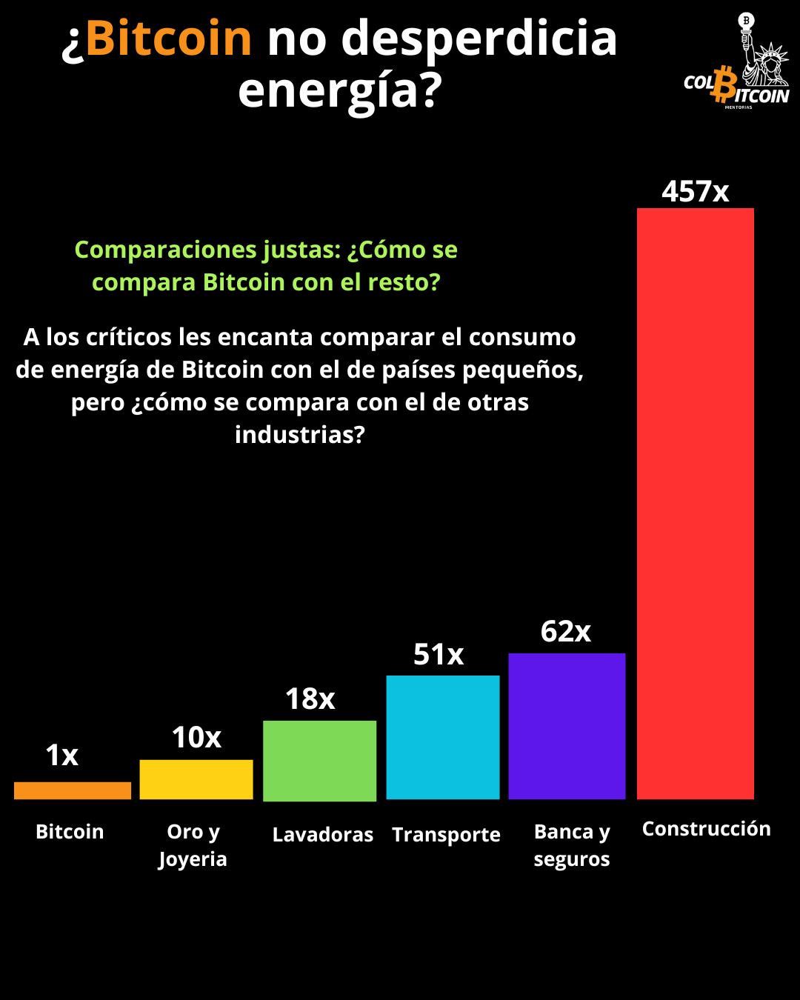

# Bitcoin y el uso de energia

**¿Bitcoin no desperdicia energía?**

Uno de los mitos más persistentes sobre Bitcoin es que "desperdicia energía": que sus operaciones mineras consumen más energía que los países pequeños y que, de alguna manera, "destruirán los océanos".

Pero ¿Bitcoin realmente desperdicia energía? ¿O utiliza la energía de una manera que aporta un inmenso valor a la sociedad?

Veamos...

## 1. El Consumo de energía refleja valor

La gente rara vez se queja del consumo de energía cuando percibe valor en lo que se alimenta.

🔹 ¿Luces navideñas? Decorativas, pero consumen mucha energía.

🔹 ¿Aire acondicionado y calefacción? Esenciales, pero muy ineficientes.

🔹 ¿Secadoras de ropa? Prácticas, pero no estrictamente necesarias.

La realidad es que todo consume energía, pero no lo cuestionamos si creemos que tiene un propósito. Bitcoin no es la excepción. Millones de personas en todo el mundo eligen destinar energía a asegurar un sistema financiero descentralizado y resistente a la censura porque le ven un inmenso valor.

Y ese es el punto clave: el desperdicio de energía depende del observador.

Algunas personas se benefician del sistema monetario actual y no ven la necesidad de Bitcoin, pero eso no significa que esté desperdiciando energía. La energía sigue la demanda, y millones de personas destinan recursos a Bitcoin porque dependen de él para su seguridad, libertad financiera y soberanía económica. Esté uno de acuerdo o no, su consumo de energía es un reflejo directo de su necesidad en el mundo real.

## 2. Bitcoin monetiza la energía desperdiciada

Una gran parte de la energía mundial se desperdicia: se genera pero nunca se utiliza. ¿Por qué? Las redes eléctricas deben sobreproducir electricidad para gestionar los picos de demanda, como cuando los aires acondicionados funcionan a toda potencia durante una ola de calor. Pero la mayor parte del tiempo, solo consumimos entre el 40 % y el 60 % de lo producido, dejando el resto sin usar.

✅ La minería de Bitcoin es independiente de la ubicación: puede implementarse en cualquier lugar con energía barata y excedente, convirtiendo la energía desperdiciada en un activo valioso (bitcoin).

✅ Los productores de energía pueden monetizar los residuos vendiendo el excedente de electricidad a los mineros, reduciendo las ineficiencias y mejorando la economía de la red.

✅ La minería de Bitcoin puede incluso reducir las emisiones; por ejemplo, la minería de gas quemado captura metano que, de otro modo, se liberaría a la atmósfera.

Bitcoin no solo consume energía, sino que absorbe la energía desperdiciada, reduce el desperdicio y mejora la eficiencia de la red.

## 3. Comparaciones justas: ¿Cómo se compara Bitcoin con el resto?

A los críticos les encanta comparar el consumo energético de Bitcoin con el de países pequeños, pero ¿cómo se compara con el de otras industrias?

🔹 Las lavadoras consumen un 18 % más de energía que Bitcoin.

🔹 La minería de oro y la producción de joyas consumen 10 veces más energía que Bitcoin.

🔹 El transporte marítimo consume 51 veces más energía que Bitcoin.

🔹 El sector financiero y de seguros consume 62 veces más energía que Bitcoin.

🔹 El sector de la construcción consume la asombrosa cantidad de 457 veces más energía que Bitcoin.

foto se consumo de energia vs bitcoin

Si el consumo energético de Bitcoin es un desperdicio, ¿no deberíamos estar debatiendo lo mismo sobre estas industrias?

## ¿En resumen?

Bitcoin es una red monetaria impulsada por energía, al igual que el sistema bancario, la minería de oro y casi cualquier otra industria.

Pero a diferencia de las finanzas tradicionales, Bitcoin:

✅ Proporciona acceso bancario a quienes no tienen acceso a ella

✅ Permite transacciones globales sin permisos

✅ Brinda a las personas bajo regímenes opresivos una herramienta para la libertad financiera

✅ Convierte la energía estancada en algo productivo

¿Es eso un desperdicio? ¿O es uno de los usos de energía más valiosos del mundo?