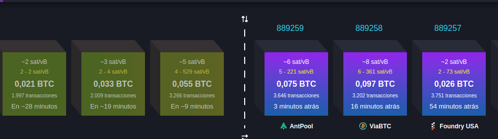
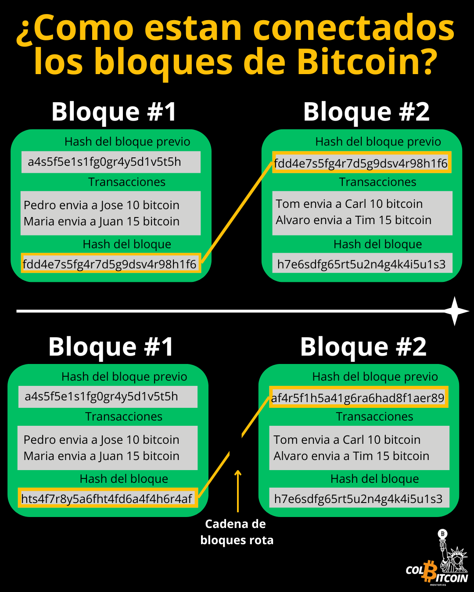

# ¿Qué es la cadena de bloques de Bitcoin?

Piensa en la cadena de bloques como el libro de contabilidad público de Bitcoin: un registro descentralizado de cada transacción realizada, almacenado en miles de ordenadores independientes en todo el mundo.

A diferencia de un libro de contabilidad bancario tradicional, controlado por una entidad central, la cadena de bloques de Bitcoin es:

✅ Descentralizada: Ninguna entidad la controla.

✅ Transparente: Cualquiera puede verificar las transacciones.

✅ Inmutable: Una vez registradas, las transacciones son prácticamente imposibles de alterar.

## ¿Cómo funciona?

Cada 10 minutos, los mineros toman transacciones sin confirmar y las empaquetan en un bloque. Cada nuevo bloque se vincula al anterior, formando una cadena; de ahí el nombre blockchain.

Pero ¿qué es lo que realmente une estos bloques?

La respuesta: el hash.

## ¿Qué es el hash?

El hash es como una huella digital: una forma de tomar cualquier entrada (texto, números, transacciones) y condensarla en una cadena de caracteres de longitud fija mediante una función matemática.

Ejemplo:

**Entrada:** “Bitcoin es la mejor moneda”.

**Salida del hash:** a3f5b8d6e2938f99cbd4b01a8c3e5c2b

**Entrada:** “Bitcoin es la MEJOR moneda”.

**Salida del hash:** df2c7b491e3a7f88ba1c9e604a5d2b3f

Incluso cambiar una sola letra da como resultado un hash completamente diferente.

Ahora viene la cosa…

**Cada bloque de Bitcoin contiene:**

✔️ Una lista de transacciones confirmadas

✔️ Una referencia al hash del bloque anterior

✔️ Un hash único para sí mismo

Esto significa que cada bloque depende del anterior, creando una cadena inquebrantable de transacciones.

imagen de como esta conectados los bloques

## ¿Por qué es esto tan poderoso?

Imagina que alguien intenta alterar una transacción de hace tres bloques. Incluso si cambiara un solo número en ese bloque:

🚨 El hash de ese bloque cambiaría.

🚨 El siguiente bloque, que hace referencia a ese hash, ya no coincidiría.

🚨 Y todos los bloques posteriores también se romperían.

Para reescribir el historial, habría que recalcular cada bloque después del alterado, en miles de computadoras simultáneamente, una tarea casi imposible.

Por eso, la cadena de bloques de Bitcoin se considera uno de los sistemas más seguros jamás creados.

🔒 Nadie puede alterar transacciones pasadas.

🔒 Nadie puede borrar tus fondos.

🔒 Ninguna entidad puede manipular el libro contable.

Pero aunque la cadena de bloques de Bitcoin es segura, no funciona por sí sola. Alguien necesita confirmar las transacciones y añadir nuevos bloques a la cadena.

Ahí es donde entran los mineros.

en el proximo articulo exploraremos cómo los mineros de Bitcoin protegen la red y por qué la Prueba de Trabajo hace que el sistema sea invulnerable.
