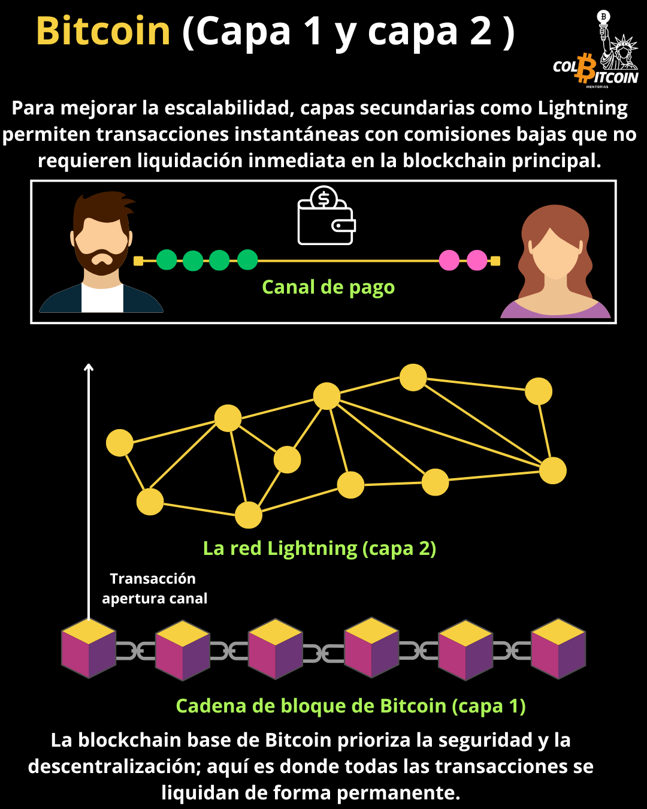

# Bitcoin capa 1 VS Bitcoin capa 2

**En cadena vs. fuera de cadena: ¿cuál es la diferencia?**

En el caso de Bitcoin, es imposible tener un sistema seguro, descentralizado e infinitamente escalable a la vez. Esto se conoce como el Trilema de la Blockchain: se pueden optimizar dos, pero no los tres.

Profundizaremos en esto pronto, pero por ahora, consideremos cómo funciona la banca tradicional:

Un banco central no procesa cada compra de café. En cambio, los bancos minoristas y las redes de tarjetas de crédito gestionan esas pequeñas transacciones, mientras que los bancos centrales liquidan grandes transferencias institucionales por valor de millones de dólares.

Bitcoin funciona de forma similar.

**Capa 1 (Transacciones en cadena):** La blockchain base de Bitcoin prioriza la seguridad y la descentralización; aquí es donde todas las transacciones se liquidan de forma permanente.

**Capa 2 (Transacciones fuera de cadena):** Para mejorar la escalabilidad, capas secundarias como Lightning permiten transacciones instantáneas con comisiones bajas que no requieren liquidación inmediata en la blockchain principal.

Cómo funcionan estas capas

## 1️⃣ Transacciones en Cadena (Capa 1 – Blockchain de Bitcoin)

Una transacción directa registrada en la blockchain de Bitcoin.

✅ Protegida por mineros e incluida en un bloque.

✅ Inmutable: una vez confirmada, no se puede modificar.

✅ Requiere espacio en el bloque, lo que significa que las comisiones fluctúan según la demanda.

🔹 Ejemplo: Si envías bitcoin desde una billetera física (hardware wallet) a otra dirección de Bitcoin, normalmente usarás la Capa 1.

Si bien son altamente seguras, las transacciones en cadena son mucho más lentas (aproximadamente 10 minutos) y pueden resultar costosas durante períodos de alta demanda.

## 2️⃣ Transacciones fuera de la cadena (Capa 2 – Red Lightning y más)

Una transacción fuera de la cadena ayuda a mantener la eficiencia de la cadena principal de Bitcoin al reducir la congestión y las comisiones. Al gestionar transacciones pequeñas y frecuentes por separado, garantiza que la capa base de Bitcoin se mantenga optimizada para la seguridad y la liquidación final, a la vez que permite una mayor flexibilidad en los pagos diarios.

**Ventajas clave de las transacciones fuera de la cadena:**

✅ **Transacciones casi instantáneas:** Sin esperas de confirmación de bloque, los pagos son prácticamente instantáneos.

✅ **Comisiones más bajas:** Al no competir por espacio de bloque, los costos de transacción se reducen significativamente.

✅ **Escalabilidad:** Permite un número mucho mayor de transacciones por segundo en comparación con las transacciones en cadena.

✅**Privacidad:** Muchas transacciones fuera de la cadena no se registran públicamente en la blockchain, lo que mejora la privacidad financiera.

✅ **Microtransacciones:** Permite pagos pequeños que serían inviables en la cadena debido a las altas comisiones.

Una de las soluciones de Capa 2 más populares es Lightning Network, que jugó un papel clave en la adopción de bitcoin como moneda de curso legal en El Salvador. Con Lightning, los salvadoreños pueden enviarse pagos instantáneos y de bajo costo entre sí, algo que sería impráctico si cada transacción tuviera que liquidarse en la capa base de Bitcoin.

## ¿Cómo funciona Lightning?

Imagínalo como abrir una cuenta en un bar:

🍺 En lugar de pagar cada bebida por separado (lo que implicaría varias transacciones), abres una cuenta con el camarero.

🍺 A lo largo de la noche, pides varias bebidas sin pagar cada vez.

🍺 Cuando estás listo para irte, pagas todo una vez y cierras la cuenta.

La Red Lightning funciona de la misma manera: abres un canal de pago con alguien, realizas las transacciones necesarias y solo pagas en la cadena cuando el canal está cerrado.

## Por qué es importante

✅ Las transacciones en cadena ofrecen máxima seguridad, pero pueden ser más lentas y costosas.

✅ Las transacciones fuera de cadena permiten pagos rápidos y escalables, a la vez que se basan en la seguridad de Bitcoin cuando es necesario.

Imagínese un sistema bancario:

🔹 **La capa 1** (en cadena) es como una transferencia bancaria: segura, pero más lenta y se utiliza para liquidaciones grandes.

🔹 **La capa 2** (fuera de cadena) es como una tarjeta de crédito: rápida, eficiente y diseñada para el uso diario.

Este enfoque en capas permite que Bitcoin se mantenga seguro y descentralizado, a la vez que escala para un uso global.