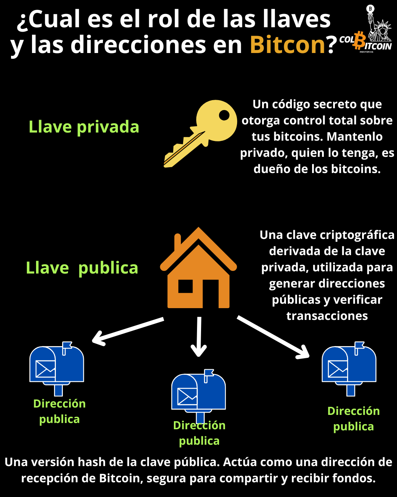

# ¿Pueden rastrear todas mis transacciones?

**Si comparto mi clave pública, ¿puede alguien ver mis bitcoins?**

Ahora que entiendes las claves privadas y públicas, quizás te preguntes: si comparto mi clave pública, ¿pueden rastrear todas mis transacciones?

Aquí es donde entran en juego las direcciones públicas.

Claves Públicas vs. Direcciones Públicas

Una clave pública es una larga cadena de letras y números derivada de tu clave privada. Sin embargo, no es lo que realmente usas para recibir bitcoins. En cambio, los monederos Bitcoin crean direcciones públicas, que actúan como una capa de privacidad.

✅ Una clave pública es como tu dirección de casa: si la compartes con todos, podrían rastrear tu correo entrante.

✅ Una dirección pública es como un apartado postal: oculta tu dirección real, pero te permite recibir bitcoins.

## ¿Por qué Bitcoin usa direcciones públicas además de claves públicas?

🔹 **Privacidad:** Si reutilizaras la misma clave pública en cada transacción, se podría rastrear todo el bitcoin que recibes.

🔹 **Seguridad:** Las direcciones públicas proporcionan una capa adicional de protección, reduciendo el riesgo de ataques.

## ¿Cómo funcionan las direcciones públicas?

• Puedes generar direcciones públicas ilimitadas sin necesidad de una nueva billetera.

• Cada dirección pública se deriva de tu clave pública, pero solo revela las transacciones asociadas a esa dirección específica, manteniendo la privacidad de la actividad general de tu billetera.

## ¿Por qué deberías evitar reutilizar direcciones?

Cada vez que usas la misma dirección pública, expones más detalles sobre tu historial de transacciones de bitcoin.

✅ Generar una nueva dirección cada vez mejora tu privacidad y seguridad.

✅ Las billeteras de Bitcoin suelen hacerlo automáticamente; no necesitas crear nuevas direcciones manualmente.

Conclusión final

Al usar direcciones públicas en lugar de claves públicas, Bitcoin te permite recibir pagos sin revelar todo tu historial de transacciones. Esta sencilla pero potente función ayuda a mantener tu actividad de bitcoin más privada y segura.
