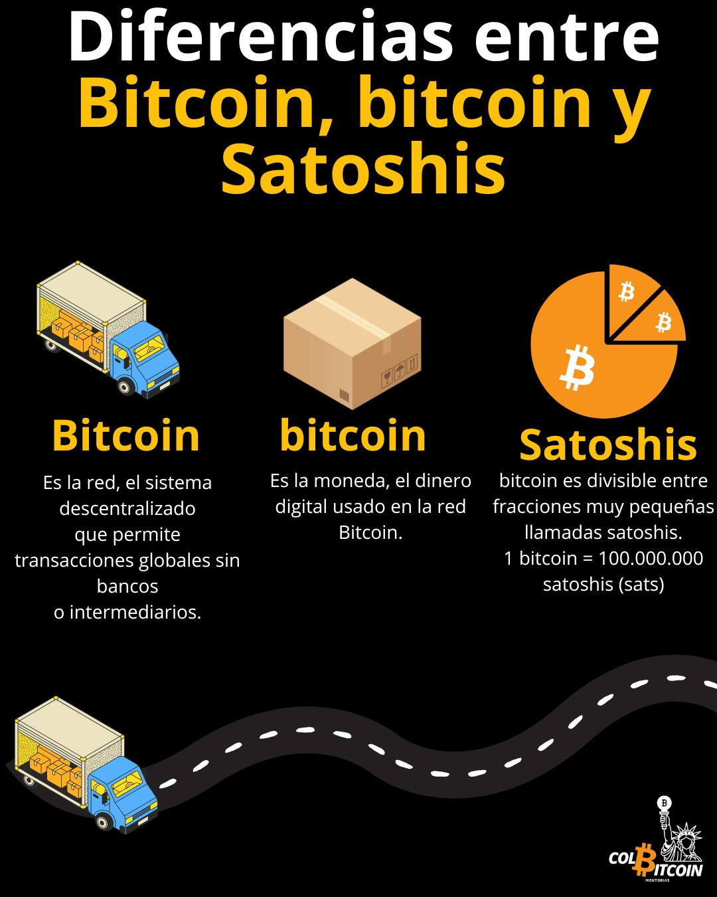
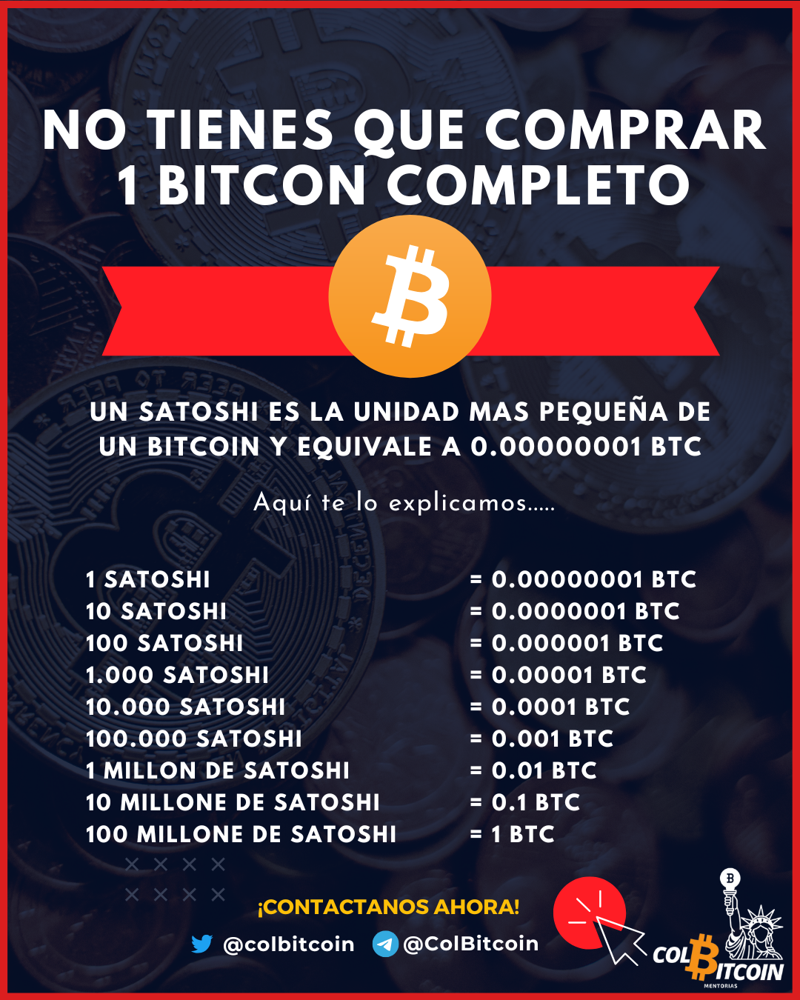

# ¿Diferencias entre Bitcoin, bitcoin y Shatosis?

¿Alguna vez has visto que Bitcoin se escribe con B mayúscula y b minúscula? ¿O has oído hablar de BTC o de "sats"? No son simples errores tipográficos; significan cosas muy diferentes.

**Bitcoin vs bitcoin**

Hay una distinción simple pero importante:

**Bitcoin** (con “B” mayúscula) → La red, el sistema descentralizado que permite transacciones globales sin bancos ni intermediarios.

**bitcoin** (con “b” minúscula) → La moneda, el dinero digital utilizado en la red Bitcoin.
Piénsalo así:

🚛 Bitcoin es la autopista (la infraestructura que mueve el valor).

📦 bitcoin es la carga (el dinero que se mueve).

**Ejemplos de oraciones:**

“Le envié 0,001 bitcoin a mi amigo.” (El activo)

“Bitcoin permite transacciones entre pares en todo el mundo.” (La red)

## ¿Qué son los satoshis (sats)?

Bitcoin es divisible en pequeñas fracciones; ahí es donde entran en juego los satoshis (sats).

1 bitcoin = 100.000.000 satoshis (sats).

Al igual que 1 dólar = 100 centavos, 1 bitcoin = 100 millones de sats

**Ejemplos de conversión:**

✔️ 1 satoshi = 0,00000001 BTC (unidad mínima)

✔️ 10.000 sats = 0,0001 BTC

✔️ 1 BTC = 100.000.000 sats

## ¿Por qué es importante esto?

Mucha gente piensa que Bitcoin es demasiado caro porque ven el precio de un BTC completo. Pero no necesitas comprar un Bitcoin completo; ¡puedes acumular sats!

Tanto si tienes 1 BTC como 100.000.000 sats, posees la misma cantidad de la red Bitcoin.

**¿Qué es BTC vs Bitcoin?**

Probablemente hayas visto que BTC se usa indistintamente con B/bitcoin, pero ¿cuál es la diferencia? BTC es simplemente el símbolo de cotización de Bitcoin, al igual que USD representa el dólar estadounidense o AAPL representa las acciones de Apple.

Mucha gente piensa que Bitcoin es demasiado caro porque ven el precio de un BTC completo. Pero no necesitas comprar un Bitcoin completo; ¡puedes acumular sats!

Tanto si tienes 1 BTC como 100.000.000 sats, posees la misma cantidad de la red Bitcoin.
Por último...

**En resumen**

✅ Bitcoin = La red

✅ bitcoin = La moneda

✅ Satoshis (sats) = La unidad más pequeña de bitcoin

✅ BTC = bitcoin

