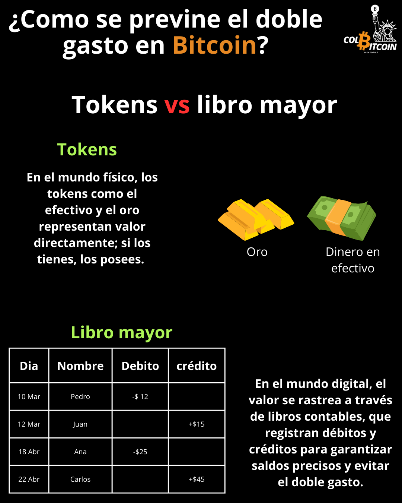

# ¿Como se previene el doble gasto en Bitcoin?

**¿Qué impide que la gente gaste el mismo bitcoin dos veces?**

En el mundo físico, el dinero funciona como una ficha: si lo tienes, es tuyo. Un billete de cinco mil pesos o una moneda de oro no necesitan verificación; simplemente pertenecen a quien los posee.

Pero en el momento en que trasladamos el dinero al mundo digital, surge un problema: los archivos digitales se pueden copiar infinitamente. Si el dinero digital funcionara igual que el efectivo, la gente podría copiar y gastar el mismo dinero varias veces, un problema conocido como doble gasto.

## La Solución: Dinero con Libro Mayor

Para evitar el doble gasto, el dinero digital requiere un libro mayor, un registro que registra la propiedad y garantiza la validez de las transacciones. A lo largo de la historia, el dinero ha funcionado de dos maneras:

1️⃣ **Basado en Tokens (Efectivo y Oro, Dinero Físico):** La propiedad se determina por la posesión. Si tienes un billete de $20.000, es tuyo; no se necesita una autoridad central para verificarlo. Esto funciona en el mundo físico porque el efectivo no se puede copiar.

2️⃣ **Basado en Libro Mayor (Cuentas Bancarias y Bitcoin, Dinero Digital):** La propiedad se registra en un libro mayor para prevenir el fraude. Cuando envías dinero a través de un banco, este ajusta los saldos en su sistema para reflejar la transferencia.

Pero los bancos tienen una falla importante: la centralización.

## ¿Por qué no usar simplemente el libro mayor de un banco?

Los bancos y los gobiernos ya mantienen libros mayores digitales, pero estos presentan problemas:

🚫 Debes confiar en que registren los saldos con precisión.

🚫 Pueden congelar tu cuenta o bloquear transacciones a voluntad.

🚫 Pueden inflar la oferta monetaria, reduciendo tu poder adquisitivo.

Bitcoin soluciona esto mediante un libro mayor público y descentralizado que ninguna entidad controla. En lugar de confiar en un banco, las transacciones de Bitcoin son verificadas por miles de nodos independientes en todo el mundo, lo que garantiza que nadie pueda manipular el libro mayor, bloquear transacciones ni reescribir el historial.

## ¿Cómo funciona el libro mayor de Bitcoin?

Bitcoin no almacena saldos como una cuenta bancaria. En cambio, registra la propiedad mediante las Salidas de Transacciones No Gastadas (UTXO) y las Salidas de Transacciones Gastadas (STXO).

Piensa en las UTXO y las STXO como si fueran dinero en efectivo:

✔️ Cuando recibes bitcoin, obtienes una UTXO, como si recibieras un nuevo billete en tu billetera.

✔️ Cuando gastas bitcoin, utilizas una o más UTXO y las conviertes en STXO, como si entregaras un billete para pagar algo.

✔️ ¿Te queda cambio? Se te devuelve como una nueva UTXO, como si recibieras cambio al pagar en efectivo.

## Saldo de tu billetera = El total de tus UTXO.

Dado que las UTXO gastadas (ahora STXO) no se pueden reutilizar, Bitcoin garantiza que cada transacción sea definitiva y elimina el doble gasto. Una vez transferido el bitcoin, este se registra en el libro mayor público y la propiedad se actualiza permanentemente.

Al usar un libro mayor distribuido, Bitcoin garantiza que cada transacción sea verificable, irreversible y resistente al fraude, sin depender de un banco central ni de un gobierno.
Esto nos lleva a la pregunta: ¿Cómo se demuestra que realmente se posee el bitcoin? Y eso es para mañana.