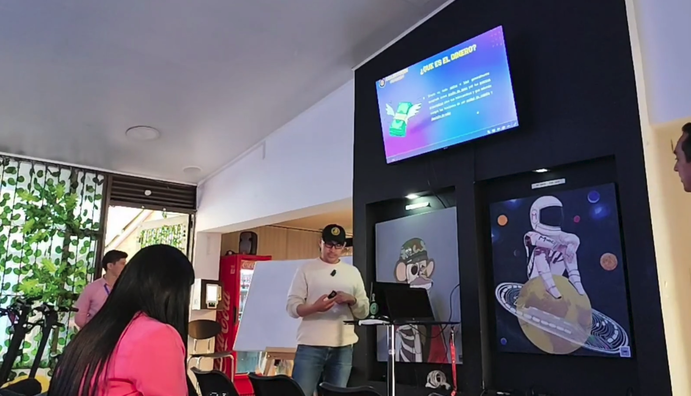

# Emprendedores aprenden sobre Bitcoin

El pasado 2 de Noviembre de 2024, tuvimos el honor de ser invitados por Mind Caffe Bogotá para hablar sobre Bitcoin frente a un grupo de emprendedores colombianos. Muchos de ellos apenas estaban comenzando a conocer el tema, así que fuimos a compartir el conocimiento en una charla única.

Durante la presentación de 45 minutos, exploramos las diferencias clave entre el dinero FIAT y Bitcoin, destacando por qué Bitcoin representa una alternativa superior. Hicimos un breve pero fascinante recorrido por la historia del dinero: desde los primeros sistemas de trueque, pasando por la era del patrón oro, hasta llegar al 31 de octubre de 2008, cuando Satoshi Nakamoto publicó el famoso _white paper_ que daría origen a Bitcoin.

Luego, los asistentes aprendieron de manera práctica cómo funciona Bitcoin, desde los fundamentos de una transacción hasta el ciclo completo de la red. ¡Y lo mejor! Descargaron un monedero Lightning en vivo y, después de pasar una prueba de trabajo, ganaron algunos satoshis como recompensa. Esta experiencia hizo que cada concepto fuera tangible y emocionante.

Para todos, tanto participantes como comunidad, fue un encuentro muy enriquecedor. Además, ¡nuestra familia creció! Nuevos miembros se unieron a @colombiap2p, y con ellos, seguimos impulsando nuestra misión de educar y expandir el conocimiento sobre Bitcoin en Colombia.

Si quieres apoyar esta misión, considera hacer una donación o comprar alguno de nuestros productos. Así, juntos, podemos seguir educando y empoderando a más colombianos. ¡Gracias por ser parte de este camino!

📹 Puedes ver el video completo en YouTube: [Ver video](https://www.youtube.com/watch?v=WyOWoKNG0pg)