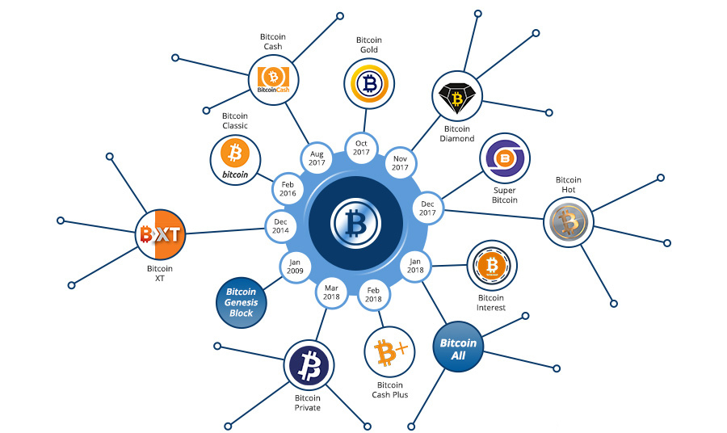

# ¿Quién decide cómo evoluciona Bitcoin?

Hay una gran pregunta que aún no hemos respondido:

💡 ¿Se puede cambiar Bitcoin? Y, de ser así, ¿cómo?

A diferencia de los sistemas financieros tradicionales, donde una autoridad central puede cambiar las reglas unilateralmente, Bitcoin es una red descentralizada. Ninguna persona, empresa o gobierno puede alterar su protocolo. En cambio, los cambios requieren el consenso de toda la red.

Así funciona:
## Los Ejecutores de las Reglas de Bitcoin: Los Nodos

Los nodos de Bitcoin son la columna vertebral de la red. Validan las transacciones y hacen cumplir las reglas de Bitcoin. Esto significa que cualquier cambio propuesto al protocolo debe ser aceptado por la mayoría de los operadores de nodos antes de que se incorpore al código de Bitcoin.

## ¿Por qué son importantes los cambios?

La capacidad de Bitcoin para cambiar es crucial para su supervivencia a largo plazo, pero debemos encontrar un equilibrio. Si Bitcoin cambia con demasiada frecuencia, introducimos inestabilidad y riesgos de seguridad, haciéndolo poco fiable como sistema monetario global. Sin embargo, Bitcoin debe ser capaz de adaptarse cuando sea necesario. Por ejemplo, si bien la computación cuántica no es una amenaza actual, si algún día la red la considera un riesgo real, el proceso de actualización descentralizado de Bitcoin permite a la comunidad implementar medidas de seguridad. Este enfoque lento y basado en el consenso garantiza que Bitcoin se mantenga seguro y adaptable, evolucionando solo cuando sea realmente necesario.

Es importante tener en cuenta que no todos los cambios son iguales…

## Bifurcaciones Suaves vs. Bifurcaciones Duras

🔹 **Bifurcaciones Suaves:** Una actualización retrocompatible. Es como actualizar una aplicación: las versiones anteriores siguen funcionando, pero las nuevas incorporan funciones adicionales. Los nodos que no se actualizan pueden seguir participando en la red.

Ejemplo: SegWit (2017), que mejoró la eficiencia de las transacciones de Bitcoin.

🔹 **Bifurcaciones Duras:** Un cambio no retrocompatible. Divide la red en dos cadenas independientes: una que sigue las reglas antiguas y la otra las nuevas. Si los nodos no se actualizan, dejan de formar parte de la red principal de Bitcoin.

Ejemplo: Bitcoin Cash (2017), una bifurcación dura que creó una nueva criptomoneda independiente, durante los años de vida de Bitcoin se han realizado varias bifurcaciones duras, como se muestra en la siguiente imagen.

Una forma sencilla de pensar en las bifurcaciones de Bitcoin es a través del lenguaje: una bifurcación suave es como agregar palabras nuevas a un idioma (los hablantes más antiguos aún pueden entender, incluso si no usan los nuevos términos), mientras que una bifurcación dura es como cambiar a un idioma completamente diferente, lo que hace que la comunicación sea imposible a menos que todos lo adopten.

## ¿Quién decide el futuro de Bitcoin?

La gobernanza de Bitcoin se rige por un consenso general, lo que significa que ninguna entidad puede forzar un cambio. Los desarrolladores pueden proponer actualizaciones, pero estas solo surten efecto si los usuarios (nodos) y los mineros aceptan adoptarlas.

🔸 Los usuarios (nodos) eligen las reglas.
🔸 Los mineros procesan las transacciones, pero no pueden imponer cambios en las reglas.
🔸 Los desarrolladores escriben propuestas, pero no pueden forzar su adopción.
Este proceso de actualización descentralizado es la razón por la que Bitcoin se mantiene estable y resistente al control central.
Bitcoin no cambia porque alguien lo diga, solo cambia cuando la gran mayoría de la red está de acuerdo. 🚀

