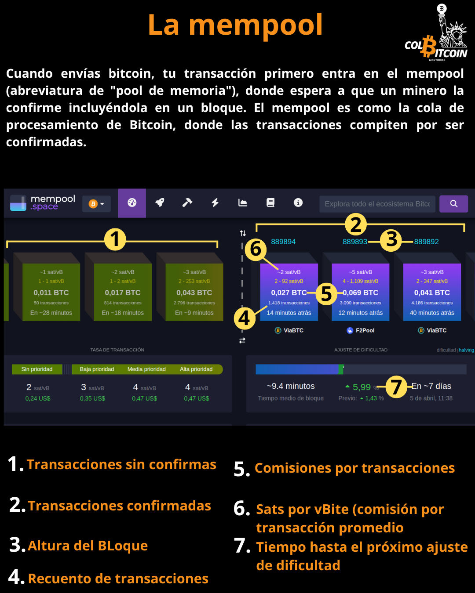

# ¿Qué es la mempool?

¿Alguna vez has enviado una transacción de Bitcoin y te has preguntado dónde va antes de que se confirme? Ahí es donde entra en juego el mempool: la sala de espera para las transacciones de Bitcoin.

## La Mempool: Transacciones Pendientes de Bitcoin

Si alguna vez has usado una tarjeta de crédito, probablemente hayas visto transacciones pendientes (pagos que aún no se han procesado oficialmente). Bitcoin funciona de forma similar:

💳 Pendiente = Transacciones Sin Confirmar (en espera de ser procesadas)

✅ Publicada = Transacciones Confirmadas (añadidas correctamente a la blockchain)

Cuando envías bitcoin, tu transacción primero entra en el mempool (abreviatura de "pool de memoria"), donde espera a que un minero la confirme incluyéndola en un bloque. El mempool es como la cola de procesamiento de Bitcoin, donde las transacciones compiten por ser confirmadas.

Los mineros priorizan las transacciones según las comisiones; las transacciones con comisiones más altas suelen confirmarse más rápido, al igual que algunas instituciones financieras procesan primero los pagos de mayor prioridad.

¿Quieres ver Bitcoin en acción? [La Mempool](http://Mempool.space)  es un recurso excepcional que te permite visualizar la actividad de Bitcoin en tiempo real, incluyendo las fluctuaciones en las comisiones por transacción según la oferta y la demanda. Incluso puedes hacer clic en cualquier bloque para ver todas las transacciones desde la creación de Bitcoin, incluyendo el primer bloque de Satoshi.

**Al visitar el sitio web, notará siete puntos de interés:**

1️⃣ **Transacciones sin confirmar:** Son transacciones que esperan en la memoria a que un minero las incluya en un bloque. Las transacciones con comisiones más altas suelen procesarse primero.

2️⃣ **Transacciones confirmadas:** Una vez que un minero añade con éxito una transacción a un bloque, esta pasa de "sin confirmar" a "confirmada", lo que la convierte en definitiva e irreversible.

3️⃣ **Altura del bloque:** La blockchain de Bitcoin crece con el tiempo a medida que se añaden nuevos bloques. La altura del bloque representa el número total de bloques minados desde la creación de Bitcoin.

4️⃣ **Recuento de transacciones:** Cada bloque contiene varias transacciones, y este recuento muestra cuántas se incluyeron en un bloque específico.

5️⃣ **Comisiones totales por transacción:** La suma de todas las comisiones por transacción pagadas en un bloque. Dado que los mineros priorizan las transacciones con comisiones más altas, este total refleja el monto pagado para incluir las transacciones en ese bloque específico.

6️⃣ **Sats por vByte (Comisión de Transacción Promedio):** Representa la comisión promedio (en satoshis) por byte de datos de transacción incluidos en un bloque. Un valor más alto de satoshis/vByte indica una mayor demanda de procesamiento de transacciones.

7️⃣ **Tiempo hasta el Próximo Ajuste de Dificultad:** Bitcoin ajusta automáticamente la dificultad de minería cada 2016 bloques (aproximadamente 2 semanas). El porcentaje mostrado (p. ej., +0,01 %) indica si el ajuste de dificultad actual aumenta o disminuye en comparación con el anterior.

## ¿Por qué es importante?

Comprender el mempool ayuda a explicar:

✅ Por qué algunas transacciones tardan más que otras

✅ Por qué fluctúan las comisiones por transacción

✅ Cómo Bitcoin mantiene su procesamiento de transacciones descentralizado y justo

La próxima vez que envíes bitcoin, visita [La Mempool](http://Mempool.space) y observa tu transacción en tiempo real. La verás entrar en el mempool, competir por su inclusión en un bloque y ser confirmada junto con miles de otras, presenciando la red descentralizada de Bitcoin en acción.

