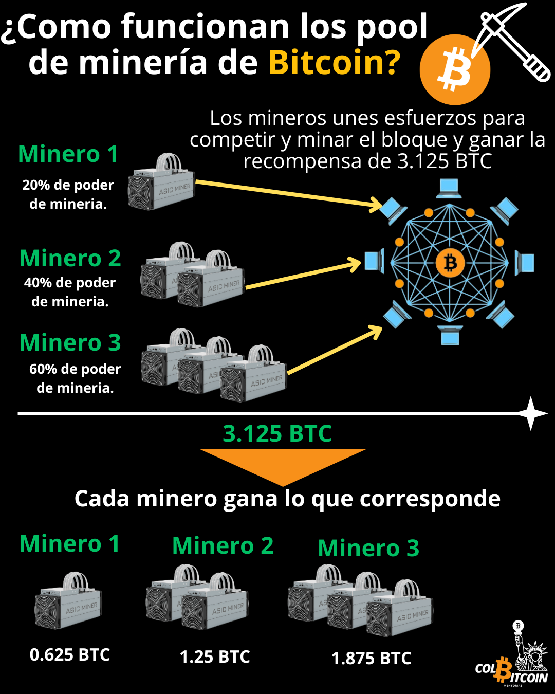
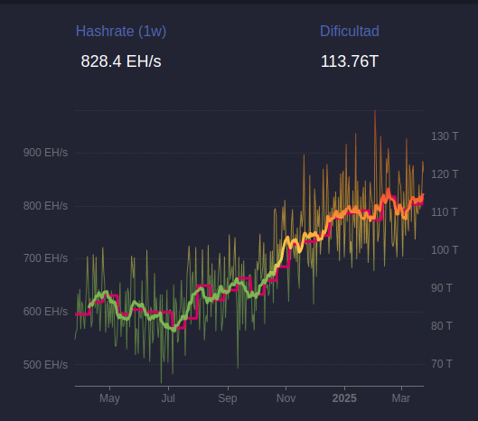

# ¿Como funciona la mineria de Bitcoin?

En las finanzas tradicionales, las transacciones las procesa una entidad centralizada: tu banco, PayPal, Visa. Estas instituciones deciden qué transacciones se procesan y tienen la facultad de censurar, revertir o congelar los pagos a voluntad.

Bitcoin elimina este control centralizado al sustituirlo por mineros: participantes independientes que procesan las transacciones.

imagen de mineria

Para garantizar que ninguna entidad tenga el control, Satoshi diseñó la minería como una competencia abierta y global, donde los mineros compiten por encontrar un bloque válido, y aproximadamente cada 10 minutos, uno lo consigue, ganándose el derecho a añadirlo a la blockchain. Lo mejor de todo es que cualquiera, en cualquier lugar, puede participar, siempre que siga las reglas de Bitcoin.

## ¿Por qué compiten los mineros?

Sencillo: Recompensas.

**Si un minero gana, ellos reciben:**

💰 Bitcoins recién acuñados (actualmente 3,125 BTC por bloque)

💰 Comisiones de transacción del bloque que añaden a la blockchain

Este incentivo económico mantiene a los mineros compitiendo, garantizando que la red se mantenga descentralizada y segura.

## ¿Cómo compiten los mineros?

En esencia, la minería es una carrera, pero no como la que la mayoría de la gente imagina. Es como un partido de golf de precisión con miles de jugadores. Todos siguen jugando, intentando conseguir una puntuación por debajo de cierto límite. El primero en lograrlo gana la ronda y el juego se reinicia.

Cada minero toma los datos de las transacciones y los procesa mediante una función criptográfica llamada hash (que ya abordamos ayer). Este proceso de hash condensa la información en un número único de longitud fija, llamado hash. Pero este hash no es aleatorio; debe cumplir un requisito estricto:

El hash debe ser inferior a un valor objetivo establecido por la red.

👉 Cuanto menor sea el número, mejor, como en el golf.

👉 Los mineros ajustan una pequeña variable de bloque llamada nonce, cambiándola con cada intento de generar un nuevo hash, repitiendo el proceso hasta generar un número por debajo del umbral objetivo. 

👉 El primer minero que genere un hash válido gana la ronda y puede añadir el siguiente bloque a la blockchain.

Cuantos más hashes genere un minero por segundo, mayores serán sus posibilidades de ganar. Por eso, los mineros utilizan hardware especializado y consumen energía.

## ¿Qué hace que Bitcoin sea más resistente a la censura que los sistemas financieros tradicionales?

Esta competencia abierta garantiza que ningún minero controle qué transacciones se procesan.

Incluso si un minero se niega a incluir una transacción, otros tienen un incentivo financiero para añadirla al siguiente bloque. Si bien una entidad puede optar por ignorar una transacción, el sistema recompensa a quienes procesan transacciones válidas, lo que garantiza que nadie pueda bloquear permanentemente una dirección, congelar sus fondos ni impedir la ejecución de un pago.

## ¿Por qué importa la energía?

✔️ **Impide el fraude:** Modificar transacciones pasadas requeriría rehacer todo el trabajo computacional en toda la red, lo cual es astronómicamente costoso y casi imposible.

✔️ **Incentiva la honestidad:** La minería es costosa. La única forma de ganar bitcoins es seguir las reglas y contribuir con potencia computacional para proteger la red.

✔️ **Garantiza el consenso global:** Dado que miles de mineros independientes compiten, ninguna entidad puede controlar ni alterar la cadena de bloques en su beneficio.

A medida que aumenta el precio de bitcoin, también lo hace su tasa de hash, una medida de la potencia computacional total que protege la red. Una tasa de hash más alta significa que hay más mineros compitiendo, lo que dificulta aún más los ataques a la red.

**Dato curioso:** Cada 10 minutos se mina un nuevo bloque. Actualmente, la recompensa por bloque es de 3,125 BTC. Esto significa que si posees 3,125 BTC, en algún momento, todos los mineros del mundo compitieron durante 10 minutos seguidos para minar el bitcoin que posees. Ese es el esfuerzo que se invierte en asegurar la red.

La minería de Bitcoin no se trata solo de crear nuevos bitcoins; es la columna vertebral de su seguridad, la resistencia a la censura y la descentralización.

Pero los mineros no controlan Bitcoin, sino los nodos. en nuestro proximo articulo se hablara de este tema.
