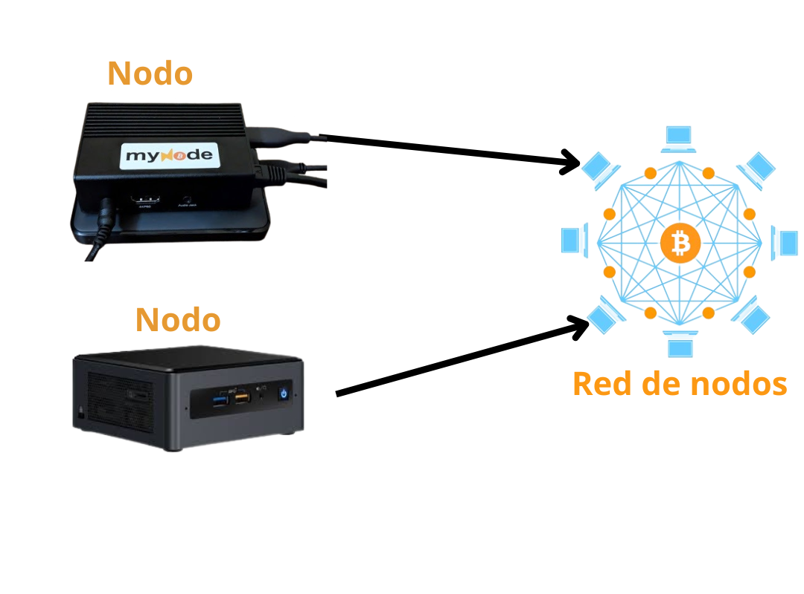

# ¿Qué es un nodo de Bitcoin?

En el articulo anterior se hablo de los minero de bitcoin, quienes procesan las transacciones y añaden nuevos bloques a la blockchain. Pero los mineros no controlan Bitcoin.

Los nodos sí, lo hacen.

Un nodo Bitcoin es un software que ejecuta el protocolo Bitcoin y aplica sus reglas. A diferencia de los mineros, que requieren hardware y energía especializados, cualquiera puede ejecutar un nodo Bitcoin con tan solo:

✅ Una computadora

✅ Una conexión a internet

✅ Aproximadamente 800 GB de almacenamiento al momento de escribir este articulo (para guardar una copia de la cadena de bloques)

## ¿Qué hacen los nodos?

Los nodos verifican y retransmiten las transacciones, garantizando que cumplan con las reglas de Bitcoin. Si alguien intenta hacer trampa, como gastar el mismo bitcoin dos veces o crear transacciones no válidas, los nodos lo rechazan.

Piensa en los nodos como árbitros en un juego: hacen cumplir las reglas, asegurándose de que todos jueguen de forma justa.

## ¿Por qué son importantes los nodos?

La seguridad de Bitcoin no reside solo en los mineros. Proviene de los miles de nodos independientes repartidos por todo el mundo.

Incluso si un minero intenta cambiar las reglas de Bitcoin, los nodos no lo aceptarán.

Ejemplo: Si alguien ejecutara una versión modificada de Bitcoin que permitiera imprimir monedas adicionales, su nodo estaría desincronizado con el resto de la red y sería ignorado.

Esto es lo que hace que Bitcoin sea verdaderamente descentralizado: ninguna persona, empresa o gobierno puede cambiar las reglas por sí solo.

## Nodos vs. Mineros: ¿Cuál es la diferencia?

**Mineros** 🏗 → Procesan transacciones y crean nuevos bloques

**Nodos** 🏛 → Verifican transacciones y aplican reglas

Los mineros compiten para ganar recompensas, pero los nodos los mantienen honestos.

## ¿Por qué deberías gestionar un nodo?

**Gestionar un nodo te ofrece:**

✔️ Control total para verificar tus propias transacciones

✔️ Verdadera soberanía: no necesitas confiar en nadie más

✔️ Apoyo a la descentralización: cuantos más nodos, más fuerte se vuelve Bitcoin

Bitcoin no está protegido por la confianza, sino por miles de nodos independientes que aplican las reglas. Ese es el poder de la descentralización. 

Dicho esto, "¿cómo garantiza el código de Bitcoin un límite estricto de 21 millones?". esto lo veremos en el proximo articulo