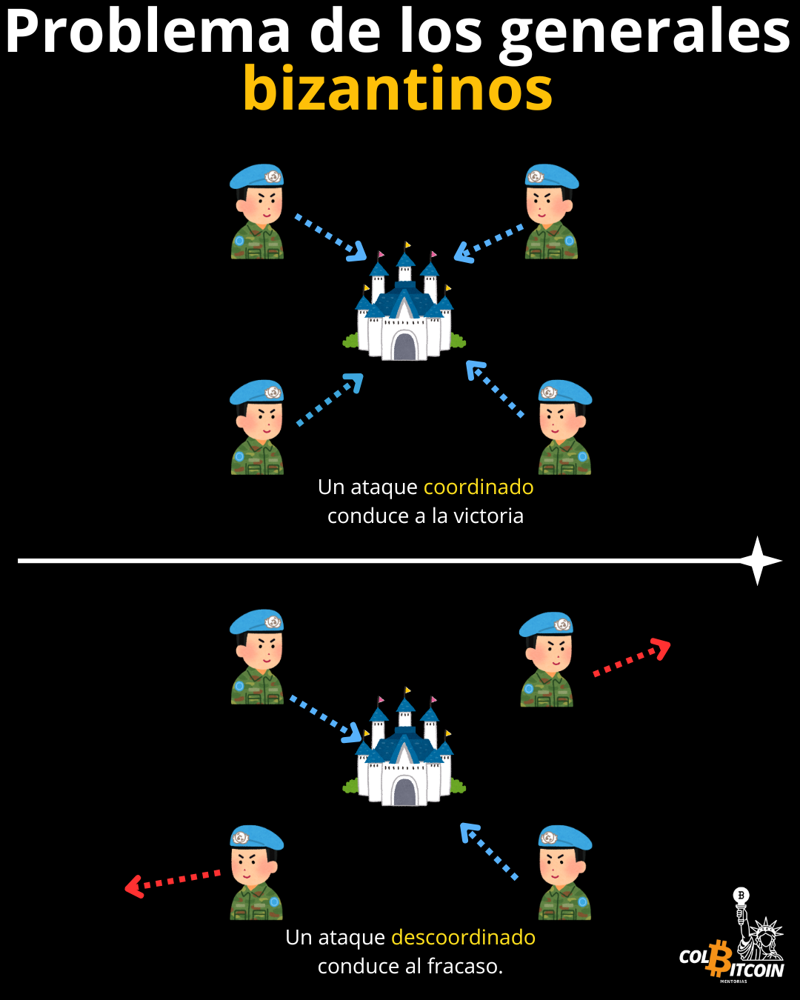

# ¿Qué problema resuelve Bitcoin?

¿Por qué se inventó Bitcoin? No es solo "dinero digital", sino una solución a uno de los mayores problemas financieros de nuestro tiempo. Aquí te explicamos por qué Bitcoin es importante.

Empezaré planteando una pregunta: ¿Cómo se envía un mensaje de forma segura cuando no se puede confiar en el mensajero?

Imagina un ejército preparándose para atacar una ciudad fuertemente fortificada. Los generales, dispersos en diferentes ubicaciones, deben coordinar un ataque al mismo tiempo, pero solo pueden comunicarse a través de mensajeros poco fiables que podrían ser interceptados, retrasados ​​o incluso enviar información falsa.

Si un solo general recibe la señal equivocada y ataca demasiado pronto o demasiado tarde, toda la misión fracasa. Así que...

## ¿Cómo pueden llegar a un consenso si no confían plenamente entre sí?

Este es el Problema de los Generales Bizantinos, un dilema clásico en informática que describe el desafío de lograr un acuerdo en un sistema donde algunos participantes podrían ser poco fiables o incluso maliciosos.

imagen generales bizantinos

Ahora, reemplacemos a esos generales con computadoras en una red global descentralizada. Antes de Bitcoin, el dinero digital tenía un gran problema:

👉 ¿Cómo se garantiza la validez de las transacciones cuando ninguna parte está al mando?

Y...

👉 ¿Cómo se evita que alguien gaste el mismo dinero dos veces (doble gasto) sin depender de un banco central o un procesador de pagos?

Actualmente, confiamos en que los bancos guarden nuestro dinero, en los procesadores de pagos lo transfieran y en los bancos centrales preserven su valor. Pero ¿qué ocurre cuando estas instituciones quiebran o actúan en contra de nuestros intereses? Si un banco congela tu cuenta, si un procesador de pagos bloquea una transacción o si un banco central infla tus ahorros, sufres las consecuencias.

Por eso es tan importante resolver el Problema de los Generales Bizantinos. Al eliminar la necesidad de confianza, Bitcoin creó un sistema monetario que opera independientemente del control centralizado. Permite a cualquiera enviar dinero sin interferencias, garantizando que las transacciones sean definitivas, seguras y resistentes a la censura.

Durante décadas, las monedas digitales fracasaron porque requerían de un tercero de confianza, como un banco, para verificar las transacciones. Bitcoin eliminó esa necesidad.

Al usar la "Prueba de Trabajo", Bitcoin resolvió el Problema de los Generales Bizantinos por primera vez en la historia, permitiendo que una red global de desconocidos se pusiera de acuerdo sobre una única fuente de verdad, sin necesidad de confiar.

