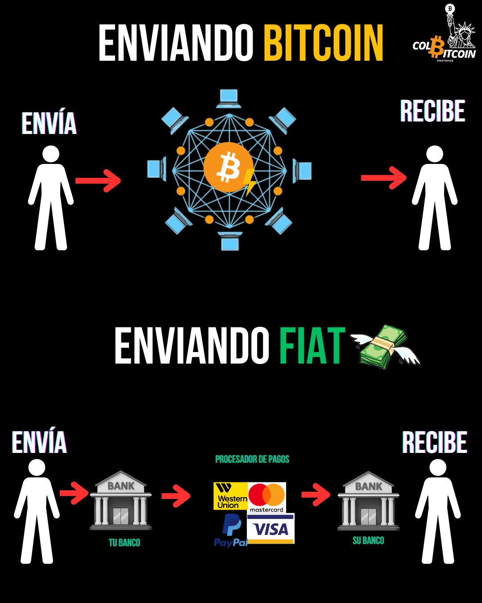

# ¿Qué es Bitcoin?

¿Qué pasaría si te dijera que existe una forma de dinero que ningún banco ni gobierno puede controlar? ¿Un sistema monetario con reglas diferentes?

Creado por el seudónimo Satoshi Nakamoto, Bitcoin es una red monetaria descentralizada entre pares que permite transacciones sin necesidad de confianza ni permisos en una moneda que almacena valor a lo largo del tiempo.

## Cualidades.

**Descentralizado:** Ninguna entidad (gobierno, banco o corporación) lo controla. En cambio, la seguridad y las reglas de Bitcoin son aplicadas por una red global voluntaria de usuarios.

**Persona a persona (P2P):** sin intermediarios. Al igual que al entregarle dinero a alguien, envías bitcoin directamente a otra persona, en cualquier parte del mundo.

**Sin confianza:** No necesitas confiar en un intermediario para verificar la transacción. El protocolo de Bitcoin garantiza la validez de las transacciones.

**Sin permisos:** nadie puede impedirte usar Bitcoin. A diferencia de las finanzas tradicionales, ningún banco puede congelar tus fondos ni negarte el acceso.

**Reserva de valor:** con un suministro fijo de 21 millones de monedas, Bitcoin está diseñado para proteger su poder adquisitivo de la inflación.

Pero **Bitcoin** no es solo otra forma de dinero: es el primer sistema monetario verdaderamente independiente, sin fronteras e incorruptible.

Durante décadas, mentes brillantes han intentado crear una moneda digital libre de control y censura. Todos los intentos han fracasado. ¿Por qué? Porque el dinero digital tenía un defecto fatal: la confianza.

Antes de Bitcoin, cada transacción en línea requería que un banco, un gobierno o un tercero garantizara que el dinero no se copiara ni se gastara dos veces. Sin una autoridad confiable, el dinero digital simplemente no podía funcionar.

Por primera vez en la historia, Bitcoin resolvió el problema de la confianza digital y permitió a las personas enviar dinero en línea sin intermediarios.

¿Cómo? Solucionando uno de los desafíos más difíciles de la informática: el Problema de los Generales Bizantinos.

¿Qué es? ¿Por qué era la pieza que faltaba?

Ese es el tema del cuarto día. Pero primero, retrocedamos y exploremos: ¿Quién es Satoshi y qué es el Libro Blanco de Bitcoin? Nos vemos mañana.

