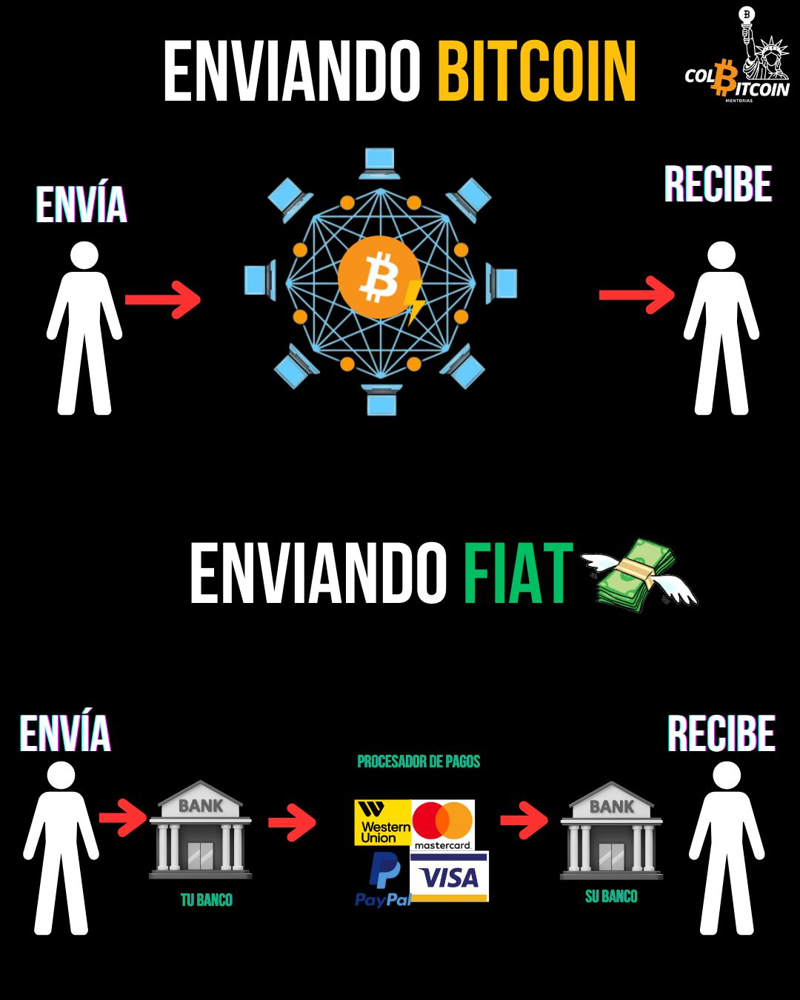

# ¿Quién es Satoshi Nakamoto?

Esta pregunta ha alimentado especulaciones, debates y teorías conspirativas durante más de una década. ¿Quién creó Bitcoin? ¿Y por qué desapareció?

¿La verdad? Nadie lo sabe.

Bitcoin fue creado por un individuo (o grupo) seudónimo conocido como Satoshi Nakamoto, quien surgió en 2008. Satoshi presentó Bitcoin a través de un documento de nueve páginas llamado The Bitcoin Whitepaper, compartido con un grupo de criptógrafos conocidos como los cypherpunks.

## ¿Qué es el libro blanco de Bitcoin?

Publicado el 31 de octubre de 2008, el Libro Blanco de Bitcoin es la base de todo lo que sabemos hoy sobre Bitcoin. Titulado "Bitcoin: Un sistema de efectivo electrónico usuario a usuario", describía cómo Bitcoin permitiría transacciones descentralizadas y sin necesidad de bancos ni intermediarios.

Pero esto no era solo una propuesta: dos meses después, Satoshi lanzó la red Bitcoin, y el resto es historia.

## ¿Qué sabemos de Satoshi?

No mucho. Satoshi era muy técnico, experto en criptografía y profundamente escéptico respecto al sistema financiero existente. Él (o ellos) se mantuvo activo en los inicios de Bitcoin, comunicándose con los desarrolladores y perfeccionando el protocolo. Pero en 2011, Satoshi desapareció, pero eso no detuvo a Bitcoin. El dinero descentralizado que crearon está más vivo que nunca, sirviendo a millones de personas en todo el mundo.

Dato curioso: Se estima que Satoshi posee entre 600.000 y 1,1 millones de BTC, una fortuna que oscila entre 57.500 millones y 105.300 millones de dólares a precios actuales. Si Satoshi se revelara, se situaría entre las 20 personas más ricas del mundo, junto a figuras como Mark Zuckerberg y Warren Buffett. Y, sin embargo, nunca han movido un solo bitcoin. Ni gastos. Ni retiros. Nada.

## ¿Por qué Satoshi creó Bitcoin?

Bitcoin fue una respuesta a la crisis financiera de 2008 y a los fracasos de la banca tradicional. Satoshi dejó un mensaje oculto en el bloque Génesis de Bitcoin (el primer bloque minado):

**“The Times 03/Jan/2009 Chancellor on brink of second bailout for banks.”**

Esto hacía referencia a un titular de periódico que anunciaba otra ronda de rescates gubernamentales para bancos en crisis. Satoshi quería un sistema monetario que no dependiera de la confianza, uno en el que los bancos centrales no pudieran imprimir dinero a voluntad ni rescatar a instituciones financieras imprudentes.

## ¿Por qué desapareció Satoshi?

La desaparición de Satoshi Nakamoto en 2011 sigue siendo un misterio, pero algunos creen que fue para reforzar la descentralización de Bitcoin, asegurando que ningún líder pudiera influir o socavarla. Otros especulan que Satoshi previó el escrutinio gubernamental, ya que Bitcoin desafía al sistema financiero existente. Al permanecer en el anonimato, evitaron convertirse en un objetivo.

Sea cual sea el motivo, su partida consolidó a Bitcoin como un sistema monetario descentralizado y sin líderes, tal como se pretendía.

Entonces, para responder a la pregunta: ¿quién es Satoshi? Nadie lo sabe. Pero quizás ese era el objetivo. Un sistema libre de gobernantes, construido para resistir el control. En mi opinión... La identidad del creador de Bitcoin es irrelevante, porque Bitcoin pertenece a todos.

Por primera vez en la historia, Bitcoin resolvió el problema de la confianza digital y permitió a las personas enviar dinero en línea sin intermediarios.

¿Cómo? Solucionando uno de los desafíos más difíciles de la informática: el Problema de los Generales Bizantinos.

