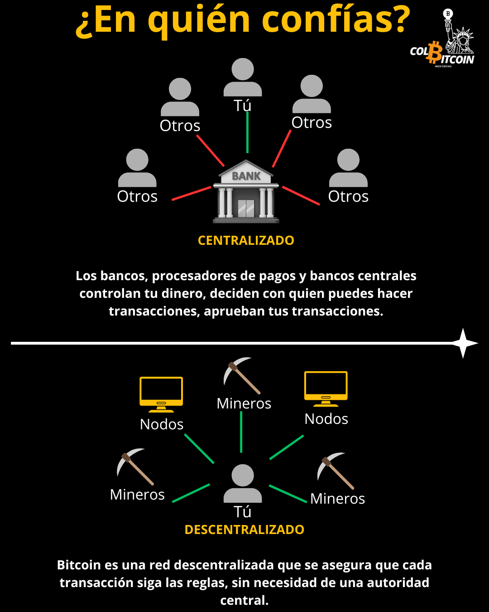

# ¿Cómo puedo confiar en un sistema sin líder?

De acuerdo con el Problema de los Generales Bizantinos: cómo llegar a un acuerdo en un sistema donde no se puede confiar en algunos participantes.

¿Por qué es importante? Porque todas las formas tradicionales de dinero dependen de intermediarios de confianza (bancos, gobiernos y procesadores de pagos) para verificar las transacciones y hacer cumplir las normas.

Bitcoin elimina a los intermediarios, solucionando así este problema.

Esto nos lleva a preguntarnos: sin intermediarios de confianza, ¿qué impide que Bitcoin caiga en el caos?

Analicémoslo. 👇

## Participantes Clave de Bitcoin: Nodos y Mineros

Para mantener un sistema financiero descentralizado, Bitcoin depende de dos actores clave:

**Nodos:** Los encargados de hacer cumplir las reglas. Los nodos son computadoras que ejecutan el software de Bitcoin. Verifican cada transacción según un estricto conjunto de reglas, como garantizar que nadie cree bitcoins adicionales ni gaste el mismo bitcoin dos veces. Si una transacción infringe las reglas, se rechaza.

**Mineros:** Los procesadores de transacciones. Los mineros compiten en una carrera global, y el ganador obtiene el derecho a agregar un nuevo bloque de transacciones a la blockchain. A cambio, reciben los bitcoins recién acuñados más las comisiones por transacción del bloque que agregaron.

## Pero ¿cómo resuelve esto el Problema de los Generales Bizantinos?

Imagina una competencia global masiva donde miles de participantes compiten para resolver un desafío. ¿La regla? Debes demostrar que hiciste el trabajo antes de poder participar. Esto es Prueba de Trabajo, y es lo que mantiene a Bitcoin seguro, sin necesidad de un banco, un gobierno ni un intermediario.

Imagínate que es como excavar en busca de oro. No puedes simplemente afirmar que encontraste oro; tienes que desenterrarlo físicamente y mostrar pruebas. Los mineros de Bitcoin hacen lo mismo, pero en lugar de excavar, usan computadoras para resolver un desafío matemático. En el momento en que un minero encuentra la solución correcta, es fácil para toda la red verificar que realizó el trabajo.

Y todo esto mientras los nodos actúan como árbitros vigilantes, garantizando que todos los participantes cumplan con las reglas.

## ¿Por qué esto resuelve el problema de los generales bizantinos?

Porque en lugar de confiar en una sola entidad para verificar las transacciones, Bitcoin se basa en un sistema competitivo donde mineros de todo el mundo compiten para procesar las transacciones de forma justa y honesta. El primer minero que añada un bloque con éxito demuestra su trabajo mediante el gasto de energía real, lo que hace que el fraude sea prácticamente imposible.

**Hacer trampa es impráctico:** si alguien intenta alterar transacciones pasadas, tendría que rehacer todo el trabajo que miles de mineros ya han realizado, una tarea imposible sin una cantidad desmesurada de energía y potencia de procesamiento.

**La honestidad es rentable:** minar cuesta dinero. La única forma de ganar bitcoins es siguiendo las reglas, lo que significa que los mineros se ven incentivados a seguir el sistema en lugar de atacarlo.

**No hay un único punto de control:** miles de mineros compiten al mismo tiempo, lo que significa que ningún gobierno, empresa o individuo puede reescribir el historial de Bitcoin ni bloquear las transacciones que no le gustan.

Al reemplazar la confianza con el trabajo, Bitcoin garantiza que las transacciones sean seguras, resistentes a la censura y verificables de forma independiente, sin necesidad de una autoridad central.

## ¿El resultado? Un sistema monetario que nadie puede manipular.

🚫 Ningún gobierno, corporación o banco central puede inflar, congelar ni censurar tus fondos.

🚫 No se necesitan intermediarios: las transacciones de Bitcoin son verificadas por miles de participantes independientes, no por una autoridad central.

🚫 Sin terceros de confianza: las transacciones son definitivas, inmutables y verificadas matemáticamente.
Al resolver el Problema de los Generales Bizantinos, Bitcoin se convirtió en la primera forma de dinero verdaderamente descentralizada, sin confianza y resistente a la censura.

Y eso lo cambia todo.

😕 Si aún no te has dado cuenta, no te preocupes. Próximamente, analizaremos la minería y los nodos con más detalle.