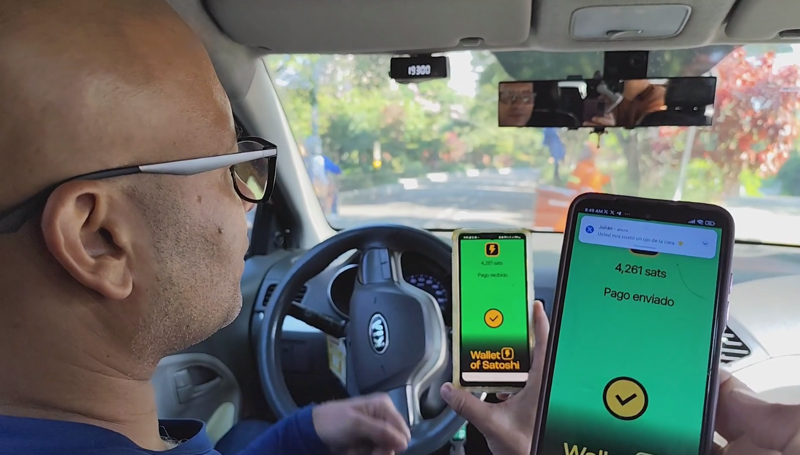

# Taxista que recibe Bitcoin en Medellín

Durante mi visita a Medellín para asistir a la conferencia BTCMedellín, tuve una experiencia que me recordó el impacto transformador de Bitcoin en la vida de las personas.

Después de finalizar mi participación en un foro al que había sido invitado, me senté a escuchar las presentaciones de otros ponentes. De repente, alguien tocó mi hombro desde atrás. Era un hombre curioso que quería hablar conmigo. Se presentó y me dijo que era taxista. Su pregunta era directa: "¿Me puedes ayudar a aprender sobre Bitcoin?"

Intrigado por su interés, decidí salir del auditorio para conversar con él. Me contó que recientemente había escuchado sobre Bitcoin gracias a un turista extranjero que le preguntó si aceptaba pagos en esta criptomoneda. Desde ese momento, se interesó en aprender más. Aunque ya había recibido algunos pagos pequeños en Bitcoin, quería profundizar en su conocimiento y aprovechar mejor esta tecnología.

Nos sentamos a conversar durante un buen rato. Le recomendé algunos monederos y le expliqué la diferencia entre los monederos custodiales y los no custodiales, enfatizando la importancia de tener control sobre sus propios fondos. También lo guié para que descargara Telegram y se uniera a nuestra comunidad ColombiaP2P, donde podría aprender a comprar y vender Bitcoin de manera descentralizada utilizando herramientas como LNP2PBot.

Al día siguiente, Wilson pasó a recogerme en su taxi para llevarme al evento. Durante el trayecto, me concedió una pequeña entrevista y me compartió más detalles sobre su historia. Su entusiasmo era contagioso. Cuando llegamos al lugar, decidí pagarle el servicio en Bitcoin, cerrando así una experiencia única que une la innovación tecnológica con la vida cotidiana de una ciudad como Medellín.

¿Quieres conocer toda la historia?

📹 Puedes verla completa en YouTube: [Ver video](https://youtu.be/92Mq3yORaO0)
